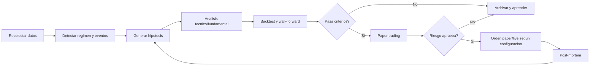

# Arquitectura del sistema

## Principio central

El sistema no intenta que un LLM "adivine" el mercado. La idea robusta es convertir a los agentes en un comite de investigacion, validacion, riesgo y ejecucion. Cada decision debe dejar trazabilidad: datos usados, hipotesis, pruebas, aprobacion de riesgo, orden propuesta, resultado y aprendizaje posterior.

La mejora no se mide por "el agente cree que mejora", sino por metricas: rendimiento fuera de muestra, drawdown, estabilidad por regimen, coste de transaccion, slippage, rotacion, correlacion con estrategias existentes y resultado en paper trading.

## Ciclo continuo



## Agentes

- `orchestrator`: coordina el ciclo, decide que tareas corren y cuando.
- `market_data_researcher`: obtiene precios, volumen, calendario, splits y datos disponibles.
- `macro_news_researcher`: resume contexto macro, eventos de mercado y noticias relevantes.
- `technical_analyst`: estudia tendencia, momentum, volatilidad, volumen, gaps y fuerza relativa.
- `fundamental_analyst`: evalua calidad financiera, valoracion, crecimiento y eventos corporativos.
- `hypothesis_generator`: convierte observaciones en hipotesis medibles y falsables.
- `quant_backtester`: prueba hipotesis con costes, slippage, walk-forward y periodos fuera de muestra.
- `risk_manager`: valida exposicion, perdida maxima, drawdown, correlaciones y concentracion.
- `portfolio_manager`: decide cartera objetivo, tamano de posicion y prioridades.
- `execution_agent`: envia ordenes solo si riesgo y configuracion lo permiten.
- `post_trade_analyst`: compara resultado contra hipotesis y detecta errores.
- `self_improvement_engineer`: propone mejoras de codigo, indicadores o prompts en sandbox.
- `compliance_guardian`: vigila limites, modo paper/live, logs, errores y bloqueo de emergencia.

## Hipotesis

Una hipotesis debe tener:

- Universo: simbolos afectados.
- Entrada: condicion objetiva, por ejemplo cruce de medias, ruptura con volumen o reversión RSI.
- Salida: take profit, stop, tiempo maximo o invalidacion.
- Expectativa: direccion, horizonte, riesgo y razon.
- Falsacion: condicion que la invalida.
- Datos minimos: periodo historico, numero minimo de operaciones y coste estimado.
- Metricas de promocion: Sharpe, Sortino, max drawdown, profit factor, hit rate, turnover, exposicion y robustez.

Ejemplo:

```json
{
  "name": "relative_strength_breakout",
  "symbols": ["AAPL", "MSFT", "NVDA"],
  "entry": "close > high_20 and volume_zscore > 1.5 and rs_vs_spy_20d > 0",
  "exit": "atr_stop_2x or 10 trading days",
  "hypothesis": "Las acciones grandes con ruptura y fuerza relativa positiva continuan en el corto plazo.",
  "invalidation": "Sharpe fuera de muestra < 0.8 o drawdown > 15%"
}
```

## Estudios tecnicos

El analisis tecnico se hace como generacion de variables y tests, no como opinion aislada:

- Tendencia: SMA/EMA 20, 50, 200; pendiente; posicion relativa del precio.
- Momentum: RSI, MACD, rate of change, maximos/minimos de N dias.
- Volatilidad: ATR, Bollinger width, volatilidad realizada, gaps.
- Volumen: z-score de volumen, OBV, rupturas con confirmacion.
- Figuras chartistas: hombro-cabeza-hombro, doble techo/suelo y triangulos como patrones medibles por pivotes, neckline y estado de ruptura.
- Fuerza relativa: rendimiento contra `SPY` y contra sector si existe dato.
- Regimen: mercado alcista/bajista, alta/baja volatilidad, correlacion media.

Cada indicador debe terminar en una variable testeable. Si no se puede medir, no entra en produccion.

## Auto-mejora

La auto-mejora tiene cuatro niveles:

1. Memoria: cada agente guarda observaciones, errores y resultados en `data/logs/agents/*.jsonl` y SQLite.
2. Retrospectiva: despues de cada ciclo, se comparan predicciones y resultados.
3. Propuestas: el agente de mejora genera cambios en `sandbox` o como texto estructurado.
4. Promocion: una mejora solo se activa si pasa tests, backtests y criterios definidos. En live trading requiere aprobacion humana.

No se permite que un agente reescriba el ejecutor de ordenes en caliente. La mejora automatica debe quedar separada del camino de ejecucion.

## Persistencia

- `data/state/agente_bolsa.sqlite3`: hipotesis, backtests, decisiones, eventos y resultados.
- `data/logs/system.jsonl`: eventos globales.
- `data/logs/agents/<agent>.jsonl`: historial individual de cada agente.
- `data/checkpoints/`: checkpoints de CrewAI para reanudar ejecuciones.
- `data/backtests/`: resultados exportados.
- `data/reports/`: informes diarios y semanales.

## Riesgo

El gestor de riesgo puede bloquear cualquier orden. Reglas iniciales:

- Exposicion maxima total: `MAX_PORTFOLIO_EXPOSURE`.
- Exposicion maxima por posicion: `MAX_POSITION_EXPOSURE`.
- Perdida diaria maxima: `MAX_DAILY_LOSS`.
- Drawdown maximo: `MAX_DRAWDOWN`.
- Sin live trading si `ALLOW_LIVE_TRADING=false`.
- Sin promocionar estrategias con pocas operaciones o malos resultados fuera de muestra.

## Kernel inmutable (T0.1)

`src/agente_bolsa/kernel.py` concentra los limites absolutos que ningun agente autonomo puede modificar (esta en `AutoApplyCodeAgent.BLOCKED_PREFIXES`). Es el suelo del sistema: una ultima validacion adicional e independiente de `risk.py`. `risk.py` sigue siendo el limite operativo, mas estricto y ajustable por los agentes; el kernel es el limite que jamas cede.

`KernelLimits` (dataclass congelada) fija: drawdown absoluto 20%, perdida diaria absoluta 5%, exposicion por posicion 15%, exposicion de cartera 100%, ratio beneficio/riesgo minimo 1.2 y un cerrojo de live trading. `kernel_check_order(plan, portfolio, settings)` se invoca en `tools/execution.py` justo antes de cada envio al broker; si devuelve `(False, motivo)` se registra el evento `kernel_block` y se aborta. Las ventas reducen riesgo y solo se frenan por el cerrojo de live o por drawdown/perdida diaria absolutos.

`kernel_integrity(settings)` calcula el SHA-256 de `kernel.py`, `tools/broker.py`, `tools/execution.py` y `.env`, y lo compara con `data/state/kernel_manifest.json` (sellado manualmente con `kernel-seal`). El job `portfolio_watch` lo verifica una vez por sesion; ante un mismatch activa el kill switch persistente y emite `kernel_integrity_violation`. Comandos: `kernel-seal`, `kernel-status --json`.

## Baseline de rendimiento e iq_score (T0.2)

`tools/performance_baseline.py` construye la serie diaria objetiva contra la que se mide toda mejora futura. `build_daily_performance` calcula equity, PnL diario/acumulado, numero de senales/compras/ventas, hit rate rodante 20 sesiones, profit factor, Sharpe rodante 60 sesiones, max drawdown, exposicion media y `alpha_vs_spy` (PnL% menos SPY%). Se persiste en la tabla `performance_daily` al final del review post-mercado. `system_iq_score` resume "cada dia mas listo" en un score 0-100 = 40% alpha normalizado + 25% hit rate + 20% profit factor + 15% calidad de promociones del laboratorio. Comandos: `performance --days 30 --json`, `iq-score --json`. El dashboard muestra equity vs SPY acumulado e iq_score.

## Sandbox git para cambios autonomos (T0.3)

`continuous_improvement/sandbox.py` (`GitSandbox`) aplica cada cambio de codigo propuesto por los agentes en un git worktree aislado sobre una rama `ci/auto/<change_id>` creada desde HEAD. Alli ejecuta la suite COMPLETA (`ruff check`, `pytest tests/ -x -q` y el smoke `run-once --skip-crew` con `DATA_DIR` temporal). Si todo pasa, fusiona con `git merge --no-ff` y deja un commit revertible y un tag `ci-auto/<id>`; si falla, guarda los logs de cada paso en `continuous_improvement_proposal_artifacts`, marca la propuesta `REJECTED_BY_TESTS` y destruye el worktree. Asi ningun cambio autonomo toca la rama de trabajo sin la suite verde, y todo `APPLIED` queda con su commit.

`AutoApplyCodeAgent.try_apply` usa el sandbox cuando `CI_SANDBOX_ENABLED=true` y el workspace es un repo git; en cualquier otro caso (p. ej. entornos de test sin git) cae al camino legacy de snapshot/restore (`_legacy_apply`). El `ci-lab rollback <id>` de un cambio fusionado se implementa como `git revert` del commit (con `-m 1` para merges) seguido de re-ejecucion de la suite. Settings: `CI_SANDBOX_ENABLED`, `CI_SANDBOX_FULL_SUITE`, `CI_SANDBOX_VALIDATE_TIMEOUT_SECONDS`.

## Registro de estrategias plugables (T1.2)

`src/agente_bolsa/strategies/` convierte una estrategia en un artefacto versionado: `base.py` define la interfaz `Strategy` (con `generate_candidates`, `exit_rules`, `metadata`) y `CandidateSignal` (mismo dict que `validate_symbol_technical_state`, para que gates y `signal_learning` no cambien). `builtin_breakout.py` es la primera estrategia: un refactor PURO del bucle de candidatos que vivía en `technical_study.py` (un test de regresión prueba que produce candidatos idénticos). `registry.py` descubre las builtin más las registradas en `strategy_versions` con estado ACTIVE/SHADOW, validando su firma con AST (sin imports de broker/execution ni red).

`technical_study.build_closed_market_technical_study` ahora acepta un `store` opcional, itera `registry.discover(store)` y etiqueta cada candidato con `strategy_name`/`strategy_version`. Con solo `builtin_breakout` ACTIVE (por defecto) el comportamiento es idéntico. Las estrategias SHADOW generan candidatos que van a `shadow_candidates` del informe y nunca llegan a `trade_decision` ni a ejecución. CLI: `strategy-registry --list-registry`, `--activate/--shadow/--retire <name>`.

## Etapa 5 — Robustez de trading: edge, estadistica y realismo

Corrige los puntos debiles que deciden si la maquina autonoma gana dinero o automatiza una estrategia mediocre.

**T5.8 Endurecer auto-escritura** (`sandbox.py`, `scripts/check_no_nulls.py`, `.github/workflows/ci.yml`, `.pre-commit-config.yaml`): cada archivo escrito en el worktree se re-lee y valida (sin bytes nulos, `ast.parse` en `.py`, byte a byte, newline final); `_apply_payload` legacy rechaza escribir sobre el repo principal; CI remota y hook pre-commit bloquean corrupcion.

**T5.1 Edge base + freeze** (`tools/naive_benchmarks.py`): `SYSTEM_FREEZE_MODE` bloquea apply/config/promocion/tuning (el laboratorio sigue aprendiendo); `edge_report` calcula alpha y t-stat vs SPY y vs momentum ingenuo, con veredicto `EDGE_CONFIRMED|EDGE_WEAK|NO_EDGE`. CLI `edge-report`.

**T5.2 Disciplina estadistica** (`hypothesis_factory.py`, `promotion.py`, `change_watchdog.py`): deflated Sharpe (penaliza por `n_trials`); promocion exige test binomial `p<0.10` y defaults 25/40/45; change budget (`MAX_CONCURRENT_PROMOTIONS`, `MAX_PROMOTIONS_PER_WEEK`) con cola QUEUED; el watchdog no compara ventanas de regimenes distintos.

**T5.3 iq_score anti-Goodhart** (`performance_baseline.py`): una promocion solo suma si su ventana post mejoro (flag del watchdog), resta si fue revertida, neutros no cuentan; `performance_daily` separa `result_metrics`/`process_metrics`.

**T5.4 Lecciones como hipotesis** (`lesson_distiller.py`): las lecciones nacen `HYPOTHESIS`; pasan a `ACTIVE` solo con `supporting>=30`, limite inferior del Wilson CI 90% por encima del hit rate base y variante derivada confirmada OOS.

**T5.5 Realismo de ejecucion** (`tools/cost_calibration.py`): slippage sintetico (round-trip + media horquilla ATR), limit orders con techo de gap (`MAX_ENTRY_GAP_PCT`/`USE_LIMIT_ENTRIES`) y calibracion de bps de coste con fills reales.

**T5.6 Sesgo de supervivencia** (`universe.py`): `universe_as_of(date)` reconstruye la composicion point-in-time desde `data/universe/sp500_changes.csv` (fallback al universo actual con `survivorship_biased=true`); la fabrica aplica un haircut (`SURVIVORSHIP_HAIRCUT`) a los umbrales cuando hay sesgo.

**T5.7 Cash activo y regimen** (`strategies/cash_allocation.py`): `target_cash_pct` segun regimen/tesis/drawdown con floors; la fabrica reserva cuota (`FACTORY_REGIME_QUOTA`) para variantes de rango/bajista; estrategias con `target_regime`; shorts solo SHADOW.

**T5.9 Presupuesto LLM** (`llm_usage.py`, `llm_router.py`): tabla de precios por modelo, gasto diario por rol; `chat_for_role` degrada a local si se agota el presupuesto del rol `deep` y lanza `LLMBudgetExhausted` (posponer tarea) si se agota el total; coste vs PnL en el digest.

**T5.10 Huecos operativos** (`tools/corporate_actions.py`): decision determinista ante earnings en posiciones abiertas, ajuste de outcomes por splits/dividendos, deteccion de halts.

**T5.11 Diversidad del comite** (`tools/committee_diversity.py`): correlacion de votos por par de modelos (redundantes si coinciden >95% en >=50 dictamenes) e invariante de gobierno: ninguna compra sin candidato determinista.

## Etapa 4 — Gobierno por riesgo y camino a live

**T4.1 Presupuesto de riesgo** (`risk_budget.py`): sustituye la maraña de gates finos de cantidad por un contrato simple — VaR diario total (`RISK_BUDGET_DAILY_VAR_PCT`), riesgo nuevo por día (`...MAX_NEW_RISK_PER_DAY_PCT`) y riesgo por cluster correlacionado/sector (`...MAX_CORRELATED_CLUSTER_PCT`). `RiskBudget.from_settings` acota el presupuesto a los límites del kernel (T0.1). `check_order` consulta `available()` antes de cada compra y consume el presupuesto; `release_position` lo libera. Es tuneable por los agentes vía `AutoApplyConfigAgent` (dentro del kernel) y el watchdog lo recorta −25% tras rollbacks. Gated por `RISK_BUDGET_ENABLED`. CLI: `risk-budget`.

**T4.2 Dashboard de autonomía y freno humano** (`tools/autonomy_digest.py` + panel en `web_app`): el humano observa, no aprueba. `collect_autonomy_state`/`build_autonomy_digest` resumen nivel de autonomía, cambios aplicados/revertidos, promociones, agentes dinámicos, lecciones, tesis e iq_score. El botón **PAUSA TOTAL** (`pause_all`) activa el kill switch persistente, congela el laboratorio (`continuous_improvement_enabled=false`) y cancela órdenes abiertas; `resume_all` lo revierte. CLI: `autonomy-digest [--pause|--resume]`.

**T4.3 Camino a live con capital progresivo** (`tools/live_readiness.py`): se amplía el checklist con criterios automáticos verificables (≥60 sesiones de paper, alpha_vs_spy acumulado > 0, Sharpe 60 > 0.8, max drawdown < 12%, watchdog con <10% de rollbacks, 0 violaciones de kernel). El desbloqueo live es SIEMPRE humano y doble: editar `.env` (`ALLOW_LIVE_TRADING=true`) + `kernel-unlock-live` (confirmación interactiva + re-sello del manifest); los agentes no pueden hacerlo. `live_capital_recommendation` des-escala automáticamente la fracción de capital (`LIVE_CAPITAL_FRACTION`) a la mitad tras una semana con pérdida > 3% (reducir riesgo nunca requiere aprobación).

## Etapa 3 — Comprension del mercado

**T3.1 Contexto macro y tesis de mercado** (`tools/macro_context.py`, tabla `market_thesis`): `fetch_macro_events` trae calendario económico, earnings de la semana y titulares (FMP, best-effort con flag de calidad); `build_market_thesis` (modelo `deep`, una vez al día) produce una tesis con `stance` (risk_on/neutral/risk_off), `key_risks`, `key_catalysts`, `sector_bias`, `confidence`. Regla determinista: si `stance=risk_off` con confidence > `RISK_OFF_CONFIDENCE_THRESHOLD`, el límite de compras diarias se multiplica por `RISK_OFF_BUY_FACTOR` en `trade_decision`. La tesis se inyecta en el prompt de decisión. Se construye al cierre en `post_market_review_job`. CLI: `market-thesis [--build]`.

**T3.2 Fábrica de hipótesis + backtests en lote** (`tools/hypothesis_factory.py`, tabla `factory_runs`): `generate_variants` produce variantes paramétricas baratas (sin LLM) acotadas a ±30% del valor vigente, máx `FACTORY_MAX_VARIANTS_PER_NIGHT`; `run_batch` las backtestea con split temporal y aplica un filtro de supervivencia determinista (Sharpe OOS > 0.8, ≥30 trades, profit factor > 1.3, drawdown < 20%, mejora ≥10%) más un guard anti data-mining (la mejora se mantiene en 3 sub-períodos). Los supervivientes entran como hipótesis de alta prioridad. Job nocturno con presupuesto de tiempo. CLI: `factory-status [--run]`.

**T3.3 Scorecard de figuras auto-evaluado** (`tools/pattern_scorecard.py`, tabla `pattern_stats`): `build_pattern_scorecard` calcula por patrón ocurrencias, hit rate, expectancy y lift vs señales sin el patrón. `pattern_weight` convierte el peso fijo en dinámico (base × lift, acotado [0, 2×base]) con fallback al peso fijo si hay <`PATTERN_MIN_OCCURRENCES` ocurrencias; un patrón con lift < 0.8 y ≥50 casos se degrada a peso 0 (reversible si el lift se recupera). Gated por `PATTERN_DYNAMIC_WEIGHTS_ENABLED`. CLI: `pattern-scorecard [--build]`.

## Etapa 2 — Agentes que se mejoran a si mismos

**T2.1 Prompts versionados** (`prompt_store.py`, `tools/prompt_replay.py`, tabla `prompt_versions`): los prompts dejan de estar hardcodeados; `get_prompt(settings, key, default)` sirve la versión ACTIVE o cae al default (el arranque nunca depende de la base). Los agentes proponen versiones CANDIDATE y `prompt_replay.replay_decisions` las re-ejecuta sobre el histórico para medir expectancy simulada y violaciones de formato; `evaluate_prompt_promotion` exige expectancy ≥ ACTIVE y 0 violaciones en ≥30 decisiones. `trade_decision` carga su system prompt vía `get_prompt`. CLI: `prompts --import-defaults`, `prompts --key K --promote N`. Gated por `PROMPT_SELF_EDIT_ENABLED`.

**T2.2 Fábrica de agentes dinámicos** (`continuous_improvement/dynamic_agents.py`, tabla `agent_definitions`): el comité crea especialistas como datos (rol, goal, prompt, inputs, output_schema) sin tocar Python. Gate determinista: máximo `MAX_DYNAMIC_AGENTS`, inputs solo del catálogo permitido, el output_schema debe declarar `confidence` y `evidence`. `DynamicSpecialistAgent` se instancia desde la fila, construye su prompt y valida su salida. `PerformanceEvaluatorAgent.score_dynamic_agents` puntúa la utilidad y retira los inútiles. CLI: `ci-lab dynamic-agents [--score]`.

**T2.3 Retrospectiva generativa nocturna** (`tools/nightly_retrospective.py`): `collect_evidence` empaqueta pérdidas, oportunidades perdidas y ganadores no comprados del día; `generate_hypotheses` (modelo `deep`) las convierte en hipótesis falsables con `entry_rule`/`exit_rule`/`invalidation`/`evidence_refs`, descartando las que citen <`NIGHTLY_RETROSPECTIVE_MIN_EVIDENCE` casos (anti-fabulación). Se insertan en `continuous_improvement_hypotheses` (dedup por fingerprint) y alimentan T1.4. Se encadena tras `post_market_review_job`. CLI: `retrospective --date`.

**T2.4 Memoria destilada** (`continuous_improvement/lesson_distiller.py`, tabla `distilled_lessons`): `distill_lessons` agrega outcomes por setup y pide al modelo lecciones verificables (cada una debe apoyarse en un agregado real, que se guarda en `source_refs`). `revalidate_lessons` recalcula el soporte: confidence baja → WEAKENED → RETIRED (las lecciones mueren si los datos dejan de apoyarlas). Las top-K ACTIVE se inyectan en el prompt de `trade_decision` (`lecciones_validadas`, cap de tokens). CLI: `lessons [--distill|--revalidate|--retire ID]`. Gated por `LESSONS_INJECTION_ENABLED`.

## ProgrammerAgent end-to-end (T1.4)

`continuous_improvement/repo_context.py` arma el contexto para el modelo (árbol de `src/agente_bolsa/`, la interfaz `Strategy`, la estrategia builtin de ejemplo, un test de ejemplo y las reglas de DoD), acotado por tokens. `continuous_improvement/strategy_builder.py` (`StrategyBuilder`) implementa el flujo: hipótesis/spec → modelo rol `deep` genera `file_edits` completos + test obligatorio (contrato JSON estricto) → `AutoApplyCodeAgent.try_apply` valida en el sandbox (T0.3) → si pasa, abre ventana SHADOW (T1.3). Si el sandbox rechaza por tests, devuelve el log de pytest al modelo y reintenta hasta `PROGRAMMER_MAX_REPAIR_ATTEMPTS`; agotados, archiva `FAILED_BUILD` en `continuous_improvement_proposal_artifacts`. Cuando un cambio de estrategia queda APPLIED en `runtime.run_once`, se abre la ventana shadow automáticamente. Se activa con `CI_BUILD_STRATEGY_ENABLED=true`; CLI manual: `ci-lab build-strategy --spec '<json>'`.

## Champion/challenger con promocion automatica (T1.3)

`continuous_improvement/promotion.py` (`PromotionManager`) cierra el ciclo: una estrategia validada entra en SHADOW (`start_shadow` marca el registro y abre una fila en `promotion_windows`) y de SHADOW pasa a ACTIVE por métricas, sin humano. `evaluate_windows` resuelve una ventana cuando acumula ≥ `PROMOTION_MIN_SESSIONS` sesiones y ≥ `PROMOTION_MIN_SIGNALS` señales shadow maduradas; promueve si el hit rate shadow ≥ champion − `PROMOTION_HIT_RATE_MARGIN`, la expectancy supera al champion y el max drawdown ≤ `PROMOTION_MAX_DD_FACTOR`× champion. Si el reemplazo ocurre, el champion anterior pasa a SHADOW de vigilancia (degradación reversible). Datos insuficientes extienden la ventana hasta `PROMOTION_MAX_SESSIONS` y luego se rechaza de forma conservadora. Se engancha al cierre de `post_market_review_job`; cuando un cambio de estrategia queda APPLIED, `runtime.run_once` llama a `start_shadow` automáticamente. CLI: `promotions --json`, `promotions --evaluate`.

## Niveles de autonomia de codigo (T1.1)

`continuous_improvement/autonomy.py` sustituye el allowlist fijo de `AutoApplyCodeAgent` por `AUTONOMY_TIERS` progresivos. Nivel 1 (arranque) = allowlist actual; nivel 2 añade `tools/` (salvo broker/execution/risk) y `strategies/`; nivel 3 añade el núcleo de decisión (`trade_decision.py`, `position_sizing.py`, `portfolio_optimizer.py`, `scheduler.py`) y los prompts (`config/`). `kernel.py`, `broker.py`, `execution.py`, `risk.py`, `config.py` y `.env` están **bloqueados siempre**. Además un guard AST rechaza diffs que introduzcan imports de `tools.broker`/`tools.execution` no presentes antes.

La subida de nivel no es manual: `autonomy_promotion_check` sube uno cuando hay ≥ `AUTONOMY_PROMOTION_MIN_APPLIED` cambios `APPLIED` en el nivel actual, 0 rollbacks del watchdog en `AUTONOMY_PROMOTION_CLEAN_SESSIONS` sesiones y el `iq_score` medio de las últimas 10 sesiones no decrece; baja uno si hay ≥ `AUTONOMY_DEMOTE_ROLLBACKS` rollbacks recientes. El nivel vive en `runtime_state` (`code_autonomy_level`), se revisa al cierre de `post_market_review_job` y se consulta con `ci-lab autonomy-status` (evento `autonomy_level_changed` al cambiar).

## Watchdog de cambios aplicados (T0.5)

`tools/change_watchdog.py` deja todo cambio promovido en observacion. `evaluate_applied_changes` compara, para cada cambio `APPLIED` con menos de `CHANGE_WATCHDOG_WINDOW_SESSIONS` (default 5) sesiones de antiguedad, la ventana de `performance_daily` posterior al cambio contra la ventana previa equivalente: si el `iq_score` cae mas de `CHANGE_WATCHDOG_MAX_IQ_DROP` (default 10) puntos, o el hit rate cae mas de `CHANGE_WATCHDOG_MAX_HIT_RATE_DROP` (default 0.15) con al menos `CHANGE_WATCHDOG_MIN_TRADES` operaciones, marca el cambio `ROLLBACK_REQUESTED`. `execute_rollbacks` revierte esos cambios con la maquinaria de T0.3 (`git revert` + suite), el mas reciente primero cuando solapan ventana, y emite el evento `change_rolled_back` con las cifras antes/despues. Se engancha al final de `post_market_review_job`. Se desactiva con `CHANGE_WATCHDOG_ENABLED=false`.

## Router LLM por roles (T0.4)

`llm_router.py` enruta cada llamada segun un rol (`ROLE_PROFILES`): `fast` (sentimiento, resumenes; modelo local barato, 1200 tokens), `decision` (`trade_decision`; modelo medio, temperatura 0.2) y `deep` (programador, estrategas, retrospectivas; modelo potente, 16000 tokens, timeout 600s). Cada rol resuelve a settings `LLM_ROLE_<ROL>_MODEL/BASE_URL/API_KEY/MAX_TOKENS`; si no estan definidos, cae a la cadena por defecto (`configured_llm_endpoints`), de modo que desconfigurar un rol es inocuo. El rol `deep` por defecto usa el modelo del laboratorio (`IMPROVEMENT_LLM_*`). `chat_for_role(role, ...)` envuelve la logica de fallback; `news_sentiment` usa `fast` y `trade_decision` usa `decision`. El uso/coste se registra por rol en `llm_usage` (columna `role`, con `ALTER TABLE` defensivo) y se consulta con `llm-usage --by-role --json`.

## Ejecucion real

La integracion inicial prevista es Alpaca. La documentacion oficial de Alpaca indica que el paper trading se activa con `TradingClient(..., paper=True)`. Por eso el proyecto queda con `ALPACA_PAPER=true` y `TRADING_MODE=paper` por defecto.

## Limites

Este sistema puede mejorar disciplina, trazabilidad y validacion, pero no puede garantizar beneficios. La bolsa tiene riesgo de perdidas, los datos pueden tener errores, los backtests pueden sobreajustar y el rendimiento pasado no asegura rendimiento futuro.
