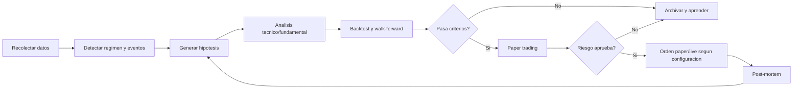

# Arquitectura del sistema

## Principio central

El sistema no intenta que un LLM "adivine" el mercado. La idea robusta es convertir a los agentes en un comite de investigacion, validacion, riesgo y ejecucion. Cada decision debe dejar trazabilidad: datos usados, hipotesis, pruebas, aprobacion de riesgo, orden propuesta, resultado y aprendizaje posterior.

La mejora no se mide por "el agente cree que mejora", sino por metricas: rendimiento fuera de muestra, drawdown, estabilidad por regimen, coste de transaccion, slippage, rotacion, correlacion con estrategias existentes y resultado en paper trading.

## Ciclo continuo



## Agentes

- `orchestrator`: coordina el ciclo, decide que tareas corren y cuando.
- `market_data_researcher`: obtiene precios, volumen, calendario, splits y datos disponibles.
- `macro_news_researcher`: resume contexto macro, eventos de mercado y noticias relevantes.
- `technical_analyst`: estudia tendencia, momentum, volatilidad, volumen, gaps y fuerza relativa.
- `fundamental_analyst`: evalua calidad financiera, valoracion, crecimiento y eventos corporativos.
- `hypothesis_generator`: convierte observaciones en hipotesis medibles y falsables.
- `quant_backtester`: prueba hipotesis con costes, slippage, walk-forward y periodos fuera de muestra.
- `risk_manager`: valida exposicion, perdida maxima, drawdown, correlaciones y concentracion.
- `portfolio_manager`: decide cartera objetivo, tamano de posicion y prioridades.
- `execution_agent`: envia ordenes solo si riesgo y configuracion lo permiten.
- `post_trade_analyst`: compara resultado contra hipotesis y detecta errores.
- `self_improvement_engineer`: propone mejoras de codigo, indicadores o prompts en sandbox.
- `compliance_guardian`: vigila limites, modo paper/live, logs, errores y bloqueo de emergencia.

## Hipotesis

Una hipotesis debe tener:

- Universo: simbolos afectados.
- Entrada: condicion objetiva, por ejemplo cruce de medias, ruptura con volumen o reversión RSI.
- Salida: take profit, stop, tiempo maximo o invalidacion.
- Expectativa: direccion, horizonte, riesgo y razon.
- Falsacion: condicion que la invalida.
- Datos minimos: periodo historico, numero minimo de operaciones y coste estimado.
- Metricas de promocion: Sharpe, Sortino, max drawdown, profit factor, hit rate, turnover, exposicion y robustez.

Ejemplo:

```json
{
  "name": "relative_strength_breakout",
  "symbols": ["AAPL", "MSFT", "NVDA"],
  "entry": "close > high_20 and volume_zscore > 1.5 and rs_vs_spy_20d > 0",
  "exit": "atr_stop_2x or 10 trading days",
  "hypothesis": "Las acciones grandes con ruptura y fuerza relativa positiva continuan en el corto plazo.",
  "invalidation": "Sharpe fuera de muestra < 0.8 o drawdown > 15%"
}
```

## Estudios tecnicos

El analisis tecnico se hace como generacion de variables y tests, no como opinion aislada:

- Tendencia: SMA/EMA 20, 50, 200; pendiente; posicion relativa del precio.
- Momentum: RSI, MACD, rate of change, maximos/minimos de N dias.
- Volatilidad: ATR, Bollinger width, volatilidad realizada, gaps.
- Volumen: z-score de volumen, OBV, rupturas con confirmacion.
- Figuras chartistas: hombro-cabeza-hombro, doble techo/suelo y triangulos como patrones medibles por pivotes, neckline y estado de ruptura.
- Fuerza relativa: rendimiento contra `SPY` y contra sector si existe dato.
- Regimen: mercado alcista/bajista, alta/baja volatilidad, correlacion media.

Cada indicador debe terminar en una variable testeable. Si no se puede medir, no entra en produccion.

## Auto-mejora

La auto-mejora tiene cuatro niveles:

1. Memoria: cada agente guarda observaciones, errores y resultados en `data/logs/agents/*.jsonl` y SQLite.
2. Retrospectiva: despues de cada ciclo, se comparan predicciones y resultados.
3. Propuestas: el agente de mejora genera cambios en `sandbox` o como texto estructurado.
4. Promocion: una mejora solo se activa si pasa tests, backtests y criterios definidos. En live trading requiere aprobacion humana.

No se permite que un agente reescriba el ejecutor de ordenes en caliente. La mejora automatica debe quedar separada del camino de ejecucion.

## Persistencia

- `data/state/agente_bolsa.sqlite3`: hipotesis, backtests, decisiones, eventos y resultados.
- `data/logs/system.jsonl`: eventos globales.
- `data/logs/agents/<agent>.jsonl`: historial individual de cada agente.
- `data/checkpoints/`: checkpoints de CrewAI para reanudar ejecuciones.
- `data/backtests/`: resultados exportados.
- `data/reports/`: informes diarios y semanales.

## Riesgo

El gestor de riesgo puede bloquear cualquier orden. Reglas iniciales:

- Exposicion maxima total: `MAX_PORTFOLIO_EXPOSURE`.
- Exposicion maxima por posicion: `MAX_POSITION_EXPOSURE`.
- Perdida diaria maxima: `MAX_DAILY_LOSS`.
- Drawdown maximo: `MAX_DRAWDOWN`.
- Sin live trading si `ALLOW_LIVE_TRADING=false`.
- Sin promocionar estrategias con pocas operaciones o malos resultados fuera de muestra.

## Ejecucion real

La integracion inicial prevista es Alpaca. La documentacion oficial de Alpaca indica que el paper trading se activa con `TradingClient(..., paper=True)`. Por eso el proyecto queda con `ALPACA_PAPER=true` y `TRADING_MODE=paper` por defecto.

## Limites

Este sistema puede mejorar disciplina, trazabilidad y validacion, pero no puede garantizar beneficios. La bolsa tiene riesgo de perdidas, los datos pueden tener errores, los backtests pueden sobreajustar y el rendimiento pasado no asegura rendimiento futuro.
