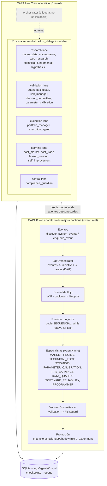
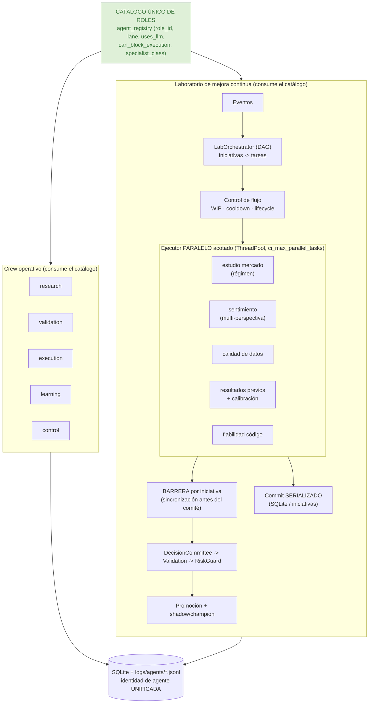

# Estudio del grupo de agentes y el orquestador: diagnóstico, unificación y paralelización

> Documento de análisis. No modifica código. Estudia cómo está organizado hoy el
> grupo de agentes y el orquestador, diagnostica los puntos débiles y propone una
> unificación de la taxonomía y una paralelización del swarm, con diagramas del
> estado **actual** y **propuesto**.

---

## 1. Objetivo del sistema (lo que el swarm debe lograr)

El sistema busca un ciclo continuo y auditable en el que un orquestador coordina a
un grupo de agentes especializados para **mejorar el código y la estrategia** a base
de iniciativas y estudios: del mercado, del propio código, del sentimiento, de
resultados anteriores y de la calidad de datos. La mejora no se acepta porque "un
agente lo crea", sino porque pasa validaciones objetivas (backtest, walk-forward,
shadow, baseline) y gates de riesgo, dejando trazabilidad completa.

En términos de swarm, el objetivo se traduce en cinco propiedades que el sistema
debe sostener simultáneamente:

1. **Especialización de roles** (research, validación, riesgo, ejecución, aprendizaje).
2. **Orquestación gobernada**: un planificador que descompone eventos en iniciativas y tareas con dependencias.
3. **Control de flujo**: límites de trabajo en curso (WIP), cooldowns y caducidad de tareas muertas.
4. **Promoción por evidencia**: nada llega a producción sin métricas que lo respalden.
5. **Reproducibilidad y auditabilidad**: cada decisión guarda datos, hipótesis, validación y resultado.

---

## 2. Estado actual

Tras revisar el código, **conviven dos sistemas de agentes distintos**, no uno solo.
Esta es la observación central del diagnóstico.

### 2.1 Capa A — Crew operativo (CrewAI)

Definida en `src/agente_bolsa/config/agents.yaml` y ensamblada en `crew.py`.

- **23 agentes** (incluido `orchestrator`) descritos con `role / goal / backstory` y metadatos: `lane`,
  `status` (`active` / `support` / `disabled`), `runtime_entrypoints`, `uses_llm` y
  `can_block_execution`.
- Organizados por **lanes**: `control`, `research`, `validation`, `execution`, `learning`.
- Agentes con poder de veto (`can_block_execution: true`): `source_reliability_agent`,
  `risk_manager`, `compliance_guardian`.

Cómo se monta realmente el crew (`crew.py`):

- `Process.sequential` y `allow_delegation=False`: **no hay delegación dinámica** ni un orquestador que reparta trabajo en tiempo real.
- Solo se instancian los agentes con `uses_llm: true` **y** referenciados por una
  tarea habilitada (`_enabled_crew_agents`). En consecuencia, el agente
  `orchestrator` del YAML (`uses_llm: false`) **ni siquiera se construye** como
  agente del crew: es una etiqueta conceptual, no un coordinador activo.

**Conclusión de la capa A:** el nombre "orquestador" promete más coordinación de la
que esta capa ejerce. Aquí los agentes son sobre todo *descripciones* y un pipeline
secuencial de tareas.

### 2.2 Capa B — Laboratorio de mejora continua (el swarm real)

Vive en `src/agente_bolsa/continuous_improvement/`. **Aquí está la orquestación de
verdad**, y es bastante más madura de lo que parece a primera vista.

Piezas principales:

- `orchestrator.py` → `ContinuousImprovementOrchestrator`: fachada que arranca el ciclo (dedupe, gate de habilitación).
- `runtime.py` → `ContinuousImprovementLabRuntime`: motor del ciclo (`run_once`).
- `orchestration.py` → `LabOrchestrator`: planificador que convierte **eventos** en **iniciativas** y **tareas** por especialista.
- `agents.py` → catálogo de **agentes especialistas** (`SPECIALIST_AGENT_CLASSES`).
- `schemas.py` → contratos tipados y el enum `AgentName`.

Flujo de un ciclo (`run_once`), resumido:

1. **Lifecycle**: caduca tareas muertas y cierra iniciativas estancadas antes de planificar.
2. Gates: `cooldown` del grupo y ventana de mercado (`_market_window`).
3. **Recolección** (`DataCollectorAgent.collect`) y **evaluación** (`PerformanceEvaluatorAgent.evaluate`); se añaden lecciones curadas.
4. **Descubrimiento de eventos** (`discover_system_events` / `enqueue_event`).
5. **Planificación** (`LabOrchestrator.create_tasks_for_event`): cada evento genera
   *initiatives* con un pipeline ordenado de especialistas. Ejemplos reales del código:
   - `entry_quality_filter`: `TECHNICAL_EDGE → STRATEGY → EXPERIMENT_DESIGNER → DECISION_COMMITTEE`
   - `opportunistic_parameters`: `PARAMETER_CALIBRATION → TECHNICAL_EDGE → STRATEGY → RISK_CAPITAL → EXPERIMENT_DESIGNER → DECISION_COMMITTEE`
   - `software_reliability`: `SOFTWARE_RELIABILITY → EXPERIMENT_DESIGNER → DECISION_COMMITTEE`
6. **Control de flujo**: WIP máximo (`ci_max_open_initiatives`), cooldown de
   recurrentes (`ci_recurring_cooldown_hours`), y enlace de evidencia a iniciativas activas en lugar de duplicar.
7. **Dependencias tipo DAG**: cada tarea recibe `dependency_ids` derivados de
   `dependency_agent_names` (las anteriores del pipeline); arranca como `WAITING_DEPENDENCY`.
8. **Ejecución** (`ready_tasks` + bucle): una tarea está *ready* solo cuando **todas**
   sus dependencias están `COMPLETED`. Cada especialista corre con **fallback
   determinista + LLM opcional** (`SpecialistAgent._maybe_llm` / `_deterministic`).
9. **Agregación y decisión**: `DecisionCommitteeAgent` integra; `ValidationAgent`
   valida con evidencia objetiva (backtest, baseline, shadow); `RiskGuardAgent` veta;
   estados de promoción `champion / challenger / shadow / micro_experiment`.

Esto cubre exactamente lo que pide el objetivo: estudios de mercado
(`MarketRegimeAgent`), sentimiento (`SentimentAnalystAgent`), código
(`SoftwareReliabilityAgent`, `ProgrammerAgent`), resultados anteriores
(`PerformanceEvaluatorAgent`, lecciones), calibración de parámetros, etc.

### 2.3 Las dos taxonomías no casan

El punto más problemático: hay **dos vocabularios de agentes paralelos** que
describen roles solapados pero viven en sistemas distintos y no comparten identidad.

| Concepto / rol | Capa A — `agents.yaml` | Capa B — `schemas.AgentName` |
|---|---|---|
| Orquestador | `orchestrator` (no se instancia) | `ORCHESTRATOR` / `CHIEF_ORCHESTRATOR` |
| Técnico | `technical_analyst` | `TECHNICAL` / `TECHNICAL_EDGE` |
| Régimen de mercado | `market_regime_strategist` | `MARKET_REGIME` / `MARKET` |
| Sentimiento / noticias | `macro_news_researcher`, `web_research_agent` | `SENTIMENT` |
| Estrategia | (implícito en varios) | `STRATEGY` |
| Calibración de parámetros | `parameter_calibration_specialist` | `PARAMETER_CALIBRATION` |
| Riesgo | `risk_manager` | `RISK` / `RISK_CAPITAL` |
| Calidad de datos | `market_data_researcher` | `DATA_QUALITY` |
| Mejora de código | `self_improvement_engineer` | `PROGRAMMER` / `SOFTWARE_RELIABILITY` |
| Comité | `decision_committee` | `DECISION_COMMITTEE` |
| Pre-earnings | `fundamental_filings_agent` | `PRE_EARNINGS` |
| Validación | `quant_backtester` | `VALIDATION` / `EXPERIMENT_DESIGNER` |
| Reporte | (post-market) | `REPORT` |

Incluso dentro de la propia capa B hay duplicidad conceptual (`MARKET` vs
`MARKET_REGIME`, `TECHNICAL` vs `TECHNICAL_EDGE`, `RISK` vs `RISK_CAPITAL`). Y la
documentación (`docs/architecture.md`) describe 13 agentes, mientras el YAML real
tiene 23 (incluido `orchestrator`): la documentación ya ha derivado respecto al código.

### 2.4 Diagnóstico: ¿está bien organizado?

En lo esencial, **sí**: el laboratorio es un swarm gobernado, con planificador,
DAG de dependencias, control de WIP, fallback determinista y promoción por
evidencia. Para un dominio con dinero y auditoría, ese diseño es acertado.

Tres debilidades concretas:

1. **Dos taxonomías de agentes que no casan** (`agents.yaml` ↔ `schemas.AgentName`),
   con solapamientos y duplicidades. Es deuda conceptual y de mantenimiento: el
   crew operativo y el laboratorio hablan idiomas distintos sobre los mismos roles.
2. **El "orquestador" de la capa A es nominal**: la orquestación real solo existe
   en el laboratorio; el nombre induce a error.
3. **El swarm ejecuta secuencialmente**: el bucle `while ready: for task in ready`
   no usa hilos ni async. Esto da reproducibilidad y auditabilidad (bueno), pero
   desperdicia paralelismo cuando hay tareas **independientes** (distintas
   iniciativas, o ramas paralelas dentro de una iniciativa).

### 2.5 Diagrama — Arquitectura ACTUAL

**Lectura del diagrama:** el trabajo real de mejora ocurre en la capa B; la capa A
aporta descripciones de roles y un pipeline secuencial. Ambas escriben en la misma
persistencia pero **no comparten identidad de agentes**.

---

## 3. Propuesta

Dos cambios, independientes entre sí y aplicables por separado: **(3.1) unificar la
taxonomía** y **(3.2) paralelizar el swarm**. Ambos preservan los gates de riesgo,
el DAG de dependencias y la auditabilidad actuales.

### 3.1 Unificación de la taxonomía de agentes

**Idea:** una sola fuente de verdad de roles, consumida por las dos capas.

Pasos:

1. **Catálogo único de roles** (un solo `agents.yaml` enriquecido, o un módulo de
   registro): cada rol declara `role`, `goal`, `lane`, `uses_llm`,
   `can_block_execution`, y su **clase especialista** del laboratorio si la tiene
   (`specialist_class`). El enum `AgentName` pasa a **derivarse** de ese catálogo en
   lugar de mantenerse a mano en `schemas.py`.
2. **Fusionar duplicados internos del laboratorio**: `MARKET`/`MARKET_REGIME`,
   `TECHNICAL`/`TECHNICAL_EDGE`, `RISK`/`RISK_CAPITAL`. Mantener un nombre canónico
   por rol y, si hace falta, una variante como *modo* del mismo agente, no como
   agente nuevo.
3. **Mapa explícito capa A ↔ capa B** (tabla de la sección 2.3 convertida en datos):
   el rol operativo `risk_manager` y el especialista de laboratorio comparten la
   misma `role_id`. Así el veto de riesgo, la trazabilidad y los logs por agente
   usan **una sola identidad**.
4. **`agent_registry.py` como punto único**: ya existe; ampliarlo para que tanto
   `crew.py` como `SPECIALIST_AGENT_CLASSES` resuelvan desde ahí.
5. **Sincronizar la documentación**: regenerar la lista de agentes de
   `architecture.md` desde el catálogo (hoy describe 13 vs 21 reales).

Beneficio: desaparece la deuda conceptual, los logs por agente se consolidan, y
añadir un rol nuevo es un solo cambio en un solo sitio.

### 3.2 Paralelización del swarm

**Idea:** ejecutar en paralelo lo que ya es independiente, **sin** tocar el orden
donde hay dependencia real. El DAG ya está modelado (`dependency_ids`); solo falta
un ejecutor concurrente que respete ese DAG.

Dónde hay paralelismo seguro hoy:

- **Entre iniciativas distintas**: las tareas de `market_regime`,
  `entry_quality_filter` y `software_reliability` no dependen entre sí.
- **Ramas paralelas dentro de una iniciativa**: especialistas sin dependencia mutua
  que hoy se serializan solo por el orden de la lista `agents`.
- **Recolección y estudios de solo lectura**: mercado, sentimiento, calidad de datos
  y resultados anteriores son lecturas idempotentes; ideales para *fan-out*.

Diseño propuesto (mínimo y reversible):

1. **Ejecutor con pool acotado**: sustituir `for task in ready` por un envío a un
   `ThreadPoolExecutor` (las tareas son I/O-bound: llamadas LLM y lecturas), con
   tamaño máximo `ci_max_parallel_tasks` (nuevo setting, p. ej. 4). Las llamadas LLM
   ya están sujetas a presupuesto por rol (T0.4/T5.9), que actúa de regulador natural.
2. **Respetar el DAG**: `ready_tasks` ya filtra por dependencias `COMPLETED`; el pool
   solo procesa el conjunto *ready* de cada vuelta. Se mantiene la semántica exacta.
3. **Barrera por iniciativa antes del comité**: `DECISION_COMMITTEE` y `VALIDATION`
   siguen siendo **puntos de sincronización** (esperan a sus dependencias), de modo
   que el "desacuerdo productivo" se agrega igual que ahora.
4. **Escrituras serializadas**: la persistencia (SQLite) y la actualización de
   iniciativas se mantienen en sección crítica o vía cola, para no introducir
   condiciones de carrera. El cómputo se paraleliza; el *commit* se ordena.
5. **Gates intactos**: cooldown, ventana de mercado, WIP, lifecycle, kernel y
   RiskGuard no cambian. La paralelización es del *cómputo de tareas ready*, no de
   los controles.
6. **Multi-perspectiva opcional (idea tomada de patrones de swarm tipo "perspective
   at scale")**: para estudios de mercado/sentimiento, lanzar en paralelo 2-3
   sub-análisis con encuadres distintos que alimenten al comité, reforzando el
   `committee_diversity` que ya existe. Esto se hace **dentro** de tu runtime, sin
   depender de un producto externo.

Qué **no** se recomienda: sustituir el orquestador por un swarm hospedado y efímero
(p. ej. Kimi Agent Swarm). Tu necesidad es un bucle persistente, gobernado y
auditable con estado en SQLite, vetos de riesgo y promoción por evidencia —lo
contrario de un swarm efímero auto-organizado que no controlas. Sus ideas útiles
(fan-out paralelo y desacuerdo productivo) se incorporan como patrones, como herramienta externa de investigación que aporta evidencia, sin ceder el control del ciclo.

### 3.3 Diagrama — Arquitectura PROPUESTA

**Diferencias clave frente al actual:**

- Una **única identidad de agente** (catálogo) alimenta ambas capas; desaparecen las dos taxonomías.
- El bucle secuencial se convierte en un **ejecutor paralelo acotado** que respeta el DAG.
- Se añaden **barreras de sincronización** explícitas antes del comité y un **commit serializado** para preservar consistencia y auditoría.
- Los gates (riesgo, kernel, WIP, ventana de mercado) permanecen idénticos.

---

## 4. Plan de adopción sugerido (incremental, bajo riesgo)

1. **Catálogo único + derivar `AgentName`** del registro; sincronizar `architecture.md`. (Sin cambio de comportamiento.)
2. **Fusionar duplicados** del laboratorio (`MARKET`/`MARKET_REGIME`, etc.) con alias temporales para no romper datos existentes.
3. **Mapa A↔B por `role_id`** y consolidación de logs por agente.
4. **Ejecutor paralelo** detrás de un flag (`ci_parallel_enabled`, `ci_max_parallel_tasks`), con barreras y commit serializado; empezar con grado 2-3.
5. **Multi-perspectiva** opcional en estudios de mercado/sentimiento alimentando `committee_diversity`.
6. **Verificación**: pruebas de regresión que comparen salidas del modo secuencial
   vs paralelo sobre los mismos eventos (deben coincidir salvo orden), y un test que
   valide que ningún rol queda huérfano entre las dos capas.

---

## 5. Resumen ejecutivo

- El sistema **ya es un swarm gobernado y maduro**, pero la orquestación real vive
  solo en el laboratorio de mejora continua; el "orquestador" del crew operativo es
  nominal.
- El principal defecto de organización es la **duplicidad de taxonomías de agentes**
  entre `agents.yaml` y `schemas.AgentName`, con roles solapados y documentación
  derivada.
- La **unificación** (catálogo único de roles que alimenta ambas capas) elimina esa
  deuda con bajo riesgo.
- La **paralelización** (ejecutor acotado que respeta el DAG, con barreras y commit
  serializado) aprovecha el paralelismo ya latente sin sacrificar gates ni auditoría.
- **No** conviene reemplazar el orquestador por un swarm hospedado y efímero; sí
  conviene **adoptar sus patrones** (fan-out paralelo y desacuerdo productivo) dentro
  del runtime propio.
