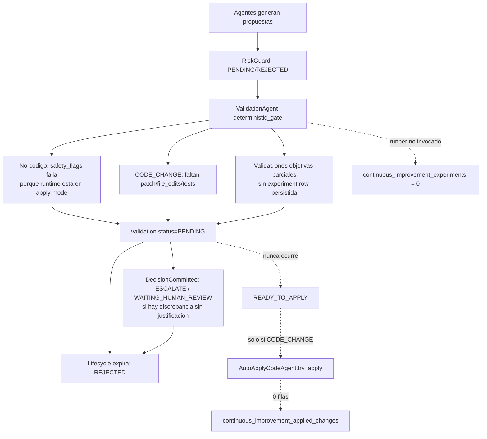

# Informe fase 0: mapa de muerte de propuestas

Fecha: 2026-06-29  
Modo: auditoria read-only sobre codigo y BD. No se modifico runtime, estado del lab ni archivos protegidos.  
BD consultada: `data/state/agente_bolsa.sqlite3` abierta en `mode=ro`.

## Resumen ejecutivo

El embudo no muere en el `apply`; muere antes. En la BD hay 1.658 propuestas, 1.654 validaciones y 24.294 decisiones, pero 0 experimentos, 0 propuestas `READY_TO_APPLY` y 0 cambios aplicados. El `AutoApplyCodeAgent` solo se invoca si una propuesta `CODE_CHANGE` alcanza validacion `READY_TO_APPLY`; eso no ocurre nunca.

Causas raiz confirmadas:

1. El runner persistente de experimentos existe (`ExperimentRunner`) pero no se invoca desde el runtime residente. El runtime ejecuta artefactos de validacion en `_execute_validation_artifacts`, pero no escribe `continuous_improvement_experiments`.
2. Las propuestas de codigo no son aplicables: 0/117 `CODE_CHANGE` tienen `patch`, `file_edits/files` o `test_commands`. Todas quedan `PENDING` en la compuerta determinista por `code_artifact_applicable=false`, `code_tests_declared=false` y `code_files_declared=false`.
3. La configuracion efectiva esta en modo apply habilitado para codigo (`dry_run=false`, `allow_auto_apply=true`, `require_human_approval_for_code_changes=false`), pero las propuestas no-codigo fallan `safety_flags` porque la validacion espera lo contrario para no-codigo: `dry_run=true` y `allow_auto_apply=false`. Resultado: pasan evidencia objetiva a veces, pero el estado final queda `PENDING`.

## Conteo por estado

### Iniciativas

| Estado | Conteo |
|---|---:|
| REJECTED | 577 |
| VALIDATING | 12 |
| OPEN | 0 |
| READY_TO_APPLY | 0 |
| CLOSED | 0 |
| APPLIED | 0 |

### Propuestas

| Estado | Conteo |
|---|---:|
| REJECTED | 1.645 |
| PENDING | 13 |
| OPEN | 0 |
| VALIDATING | 0 |
| READY_TO_APPLY | 0 |
| CLOSED | 0 |
| APPLIED | 0 |

### Tablas del embudo

| Tabla | Filas |
|---|---:|
| `continuous_improvement_proposals` | 1.658 |
| `continuous_improvement_validations` | 1.654 |
| `continuous_improvement_decisions` | 24.294 |
| `continuous_improvement_experiments` | 0 |
| `continuous_improvement_applied_changes` | 0 |

Validaciones por estado: `PENDING=1.570`, `PASSED=84`, `READY_TO_APPLY=0`. Dentro del payload objetivo hay `objective_status=READY_TO_APPLY` en 55 casos, pero no se convierten en estado final `READY_TO_APPLY` porque fallan checks deterministas.

Checks fallidos mas frecuentes:

| Check | Fallos |
|---|---:|
| `safety_flags` | 1.399 |
| `tests_evidence` | 906 |
| `code_artifact_applicable` | 109 |
| `code_tests_declared` | 109 |
| `code_files_declared` | 109 |
| `risk_review` | 45 |
| `tests_required` | 38 |
| `backtest_required` | 24 |

## Trazas de muerte

1. `ci_prop_32c84b2fbacc` (`CODE_CHANGE`, `PENDING`, iniciativa `software:micro_batch_execution`): propone ejecutar observaciones en micro-lotes. Muere en validacion `PENDING`: no trae `patch/file_edits`, no declara tests, no declara archivos objetivo. Sin experimentos ni apply.
2. `ci_prop_acdb811c029f` (`CODE_CHANGE`, `REJECTED`, `software:deterministic_gate`): intenta relajar la compuerta para low-risk en paper mode. Guard inicial `REJECTED` por `dangerous_term`; validacion tambien queda `PENDING` por falta de artefacto aplicable.
3. `ci_prop_76f6443b49b4` (`CODE_CHANGE`, `REJECTED`, `software:runtime_reliability`): mejora generica de error recovery. Validacion `PENDING` por falta de patch/tests/files; luego lifecycle la expira por "validacion pendiente sin evidencia objetiva durante 28.1 dias".
4. `ci_prop_01c88dc55a97` (`CODE_CHANGE`, `REJECTED`, `software:validation_processor`): propone loop de procesamiento de validaciones. Mismo fallo de artefacto aplicable; lifecycle la expira tras 18.2 dias.
5. `ci_prop_8420157c8e2d` (`CODE_CHANGE`, `PENDING`, `software:observation_execution_parameters`): parametros conservadores `batch_size=2`, `daily_limit=10`, pero expresados como prosa, sin diff ni tests. Queda `PENDING`.
6. `ci_prop_71120d536576` (`MONITORING_CHANGE`, `PENDING`): objetivo `PASSED`, pero `safety_flags=false` porque no-codigo espera `dry_run=true` y `allow_auto_apply=false`; la configuracion efectiva es la inversa.
7. `ci_prop_855fe8288310` (`DATA_QUALITY_CHANGE`, `REJECTED`, `trading:signal_consolidation`): el objetivo llega a `READY_TO_APPLY`, pero falla `safety_flags` y `tests_evidence`; el DecisionCommittee escala a `WAITING_HUMAN_REVIEW` por discrepancia sin justificacion, y el lifecycle expira la iniciativa.
8. `ci_prop_f51374fb3e9d` (`RISK_RULE_CHANGE`, `REJECTED`, `trading:pre_earnings_risk_veto`): evidencia objetiva parcial `PASSED`, pero faltan validaciones completas de challenger/riesgo. El comité emite `ESCALATE/WAITING_HUMAN_REVIEW`; lifecycle expira por validacion estancada.

## Autonomia y apply

Estado efectivo reportado por `continuous-improvement-lab autonomy-status`:

| Campo | Valor |
|---|---|
| `enabled` | true |
| `dry_run` | false |
| `allow_auto_apply` | true |
| `require_human_approval_for_code_changes` | false |
| `allow_live_trading` | false |
| `code_autonomy_level` | 1 |
| `ready_to_apply` | 0 |
| `applied` | 0 |
| `rolled_back` | 0 |

Nivel activo: 1. Permite editar solo `continuous_improvement/`, algunos `tools/operational_*`, `reporting.py`, `retention.py`, `tests/`, `docs/` y `.env.example`. Bloqueados siempre: `kernel.py`, `broker.py`, `execution.py`, `risk.py`, `config.py`, `.env`, `data/`, `logs/`, etc.

Huevo-y-gallina confirmado: `autonomy_promotion_check` exige al menos 10 cambios `APPLIED` en el nivel actual, 0 rollbacks recientes y tendencia de `iq_score` estable. La BD tiene 0 `APPLIED`, asi que no puede subir de nivel. Ademas `iq_trend_ok=false`.

El apply no esta en dry-run permanente: `dry_run=false` y `allow_auto_apply=true`. Pero no se invoca porque el runtime solo llama `AutoApplyCodeAgent.try_apply(...)` cuando `proposal_type == "CODE_CHANGE"` y `validation["status"] == "READY_TO_APPLY"`. Ese estado final no aparece en ninguna validacion.

`StrategyBuilder`/ProgrammerAgent tiene una ruta buena: genera `file_edits` + test, construye una propuesta `CODE_CHANGE READY_TO_APPLY` y llama `AutoApplyCodeAgent`. Pero esta ruta solo aparece conectada al CLI `continuous-improvement-lab build-strategy` y ademas esta gated por `CI_BUILD_STRATEGY_ENABLED=false` por defecto. No es el flujo que produjo las 117 `CODE_CHANGE` historicas.

## Experiment runner

`continuous_improvement/experiments.py` define `ExperimentRunner.run_for_proposal(...)` y este metodo si persistiria filas en `continuous_improvement_experiments`. Pero la busqueda de referencias muestra que no se instancia ni se llama desde `runtime.py`; solo esta la clase y tests.

El runtime residente usa una ruta paralela: `ContinuousImprovementLabRuntime._execute_validation_artifacts(...)` ejecuta backtest, session retrospective y walk-forward, y luego inyecta esos reportes en el contexto de `ValidationAgent`. Esa ruta genera reportes/eventos, pero no llama a `save_continuous_improvement_experiment`. Por eso `experiments=0` aunque existan propuestas con `required_validations`.

## Calidad de propuestas

Muestreo de las 20 propuestas mas recientes: 0/20 ejecutables. Todas son prosa con intencion ("add logging", "batch size 5", "error handling"), pero sin especificacion aplicable completa.

Cuantificacion global con heuristica conservadora:

| Tipo | Total | Ejecutables | Patch | File edits | Test commands |
|---|---:|---:|---:|---:|---:|
| CODE_CHANGE | 117 | 0 | 0 | 0 | 0 |
| MONITORING_CHANGE | 1.152 | 23 | 0 | 0 | 0 |
| DATA_QUALITY_CHANGE | 255 | 12 | 0 | 0 | 0 |
| PARAMETER_CHANGE | 22 | 3 | 0 | 0 | 0 |
| RISK_RULE_CHANGE | 108 | 0 | 0 | 0 | 0 |
| PROMPT_CHANGE | 4 | 0 | 0 | 0 | 0 |

Lectura: solo 38/1.658 propuestas parecen "parametricas" por contener parametro+valor reconocible. Ninguna propuesta de codigo historica trae diff/patch/test, asi que el `ProgrammerAgent` no esta entregando el contrato que `AutoApplyCodeAgent` exige.

## Mapa de muerte

## Recomendacion priorizada

1. Desatascar primero Fase 1 experimentos. Conectar el flujo residente a `ExperimentRunner.run_for_proposal(...)` o hacer que `_execute_validation_artifacts(...)` persista cada backtest/walk-forward/session retrospective en `continuous_improvement_experiments`. Esto no requiere subir autonomia ni tocar apply; solo convierte evidencia ya generada en trazabilidad medible.
2. Despues corregir el contrato de propuestas. Para `CODE_CHANGE`, el ProgrammerAgent debe emitir `file_edits` o `patch` + `test_commands` + archivos objetivo. Sin esto, Fase 2 codigo seguira bloqueada aunque el apply este habilitado.
3. Separar modos de validacion para no-codigo y codigo. Hoy `ValidationAgent` exige dry-run/no-autoapply para no-codigo mientras el runtime real esta en autoapply de codigo. Esa contradiccion mata propuestas con evidencia objetiva. Debe convertirse en check por tipo de propuesta, no en bloqueo global.

Orden recomendado: Fase 1 experimentos antes que Fase 2 codigo. Motivo: el embudo necesita evidencia persistida para dejar de expirar iniciativas y para que el comité deje de escalar por ambiguedad. Una vez `experiments/semana > 0`, activar la ruta `StrategyBuilder`/ProgrammerAgent con contrato aplicable y sandbox tiene sentido.
